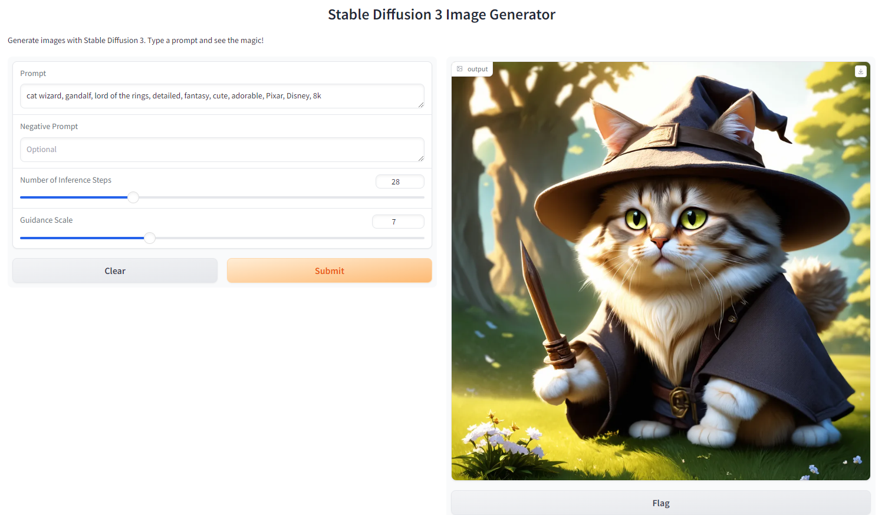

<div align="center">

# Docker image for Stable Diffusion 3 Medium Gradio

[](https://www.python.org/downloads/)
[](https://developer.nvidia.com/cuda-downloads)

<p align="center">
  
</p>
</div>

> [!NOTE]
> Stable Diffusion 3 is gated. You have to accept the terms & conditions on https://huggingface.co/stabilityai/stable-diffusion-3-medium. Then create an environment variable `HF_TOKEN` with your huggingface token.
> 
## Tags
| Tag    | Description              | Size      |
| ------ | ------------------------ | --------- |
| latest | python 3.10, sd 3 medium | ~ 21.7 GB |

## Ports

| Connect Port | Internal Port | Description |
| ------------ | ------------- | ----------- |
| 8912         | 8912          | SD 3 Webui  |

## Environment Variables

| Variable | Description       |
| -------- | ----------------- |
| HF_TOKEN | Huggingface Token |

## Running locally
```bash
docker run -d \
  --gpus all \
  -p 8912:8912 \
  yuvraj108c/sd-3-medium:latest
```

## Building the docker image
```bash
git clone https://github.com/yuvraj108c/stable-diffusion-3-medium-docker
cd stable-diffusion-3-medium-docker

# download HF models
pip install torch diffusers transformers accelerate sentencepiece gradio protobuf
python app.py

# build image
docker-compose build latest
```

## Credits
https://huggingface.co/stabilityai/stable-diffusion-3-medium-diffusers/discussions/19